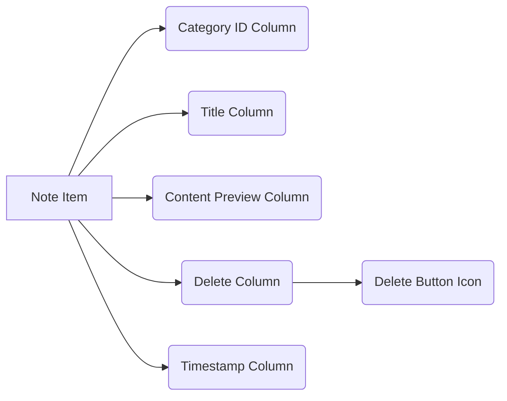

# Plan: Move Trash Selector in Notes List

## Objective

Move the delete button (trash selector) for each note item in the notes list to a new column located to the left of the timestamp column.

## Current State

The delete button is currently located within the note item's structure in `src/App.tsx`. The user has indicated it is not in the desired position.

## Target State

A new column will be created specifically for the delete button. This column will be placed between the content preview column and the timestamp column in the notes list table.

## Plan

1.  **Review `src/App.tsx`:** Examine the code responsible for rendering each note item in the notes list to understand the current arrangement of columns (Category ID, Title, Content Preview, Timestamp, and the misplaced Delete button).
2.  **Identify Delete Button Code:** Locate the specific HTML/JSX code block that renders the delete button for each note.
3.  **Rearrange Column Structure:** Modify the structure within the note item's rendering loop in `src/App.tsx`. This involves:
    - Creating a new `div` element to serve as the container for the delete button column.
    - Moving the delete button code into this new `div`.
    - Placing this new delete column `div` before the timestamp column `div`.
4.  **Adjust Styling:**
    - Add appropriate Tailwind CSS classes to the new delete column `div` to control its width and alignment (e.g., `flex-shrink-0`, `w-auto`, `px-2`).
    - Ensure existing column styles (Title, Content Preview, Timestamp) are adjusted if necessary to accommodate the new column and maintain proper spacing and alignment.
5.  **Testing:** Verify visually in the running application that the delete button is now in its own column to the left of the timestamp and that the table layout remains correct.

## Files to Modify

- [`src/App.tsx`](src/App.tsx)

## Visual Representation (Mermaid Diagram)

## Next Steps

Once this plan is approved, I will switch to Code mode to implement the changes in `src/App.tsx`.
